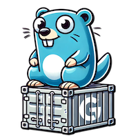

# godi 



Godi brings to Go a robust, feature-rich DI container that takes care for you of all the manual and boring work of combining your application components together.

You can focus on writing your business logic and let Godi handle the rest!

## 📋 Requirements

- Go 1.23+

## 🔧 Installation

```shell
go get github.com/michalkurzeja/godi/v2
```

## 🚀 Quick start

Here's a simple example to get you started:

```go
package main

import (
	di "github.com/michalkurzeja/godi/v2"
)

func main() {
	// Configure services and build the container.
	c, err := di.New().
		Services(
			di.Svc(NewMySvc),                       // The dependency will be autowired!
			di.Svc(NewMyOtherSvc, "Hello, world!"), // Here, we provide the dependency (string) manually.
		).Build()
	if err != nil {
		panic(err)
	}

	// Get your service - it will be instantiated by godi now.
	mySvc, err := di.SvcByType[*MySvc](c)
	if err != nil {
		// Either the container encountered an error
		// (e.g. the service of this type does not exist)
		// of the factory returned an error.
		panic(err)
	}
}

// Some dummy service implementations to demonstrate the concept

type MySvc struct {
	other *MyOtherSvc
}

func NewMySvc(other *MyOtherSvc) (*MySvc, error) {
	return &MySvc{other: other}, nil
}

type MyOtherSvc struct {
	s string
}

func NewMyOtherSvc(s string) *MyOtherSvc {
	return &MyOtherSvc{s: s}
}

```

## ⚡ Performance

Godi uses reflection to inspect your services and their dependencies.
It also performs multiple checks on the configuration to ensure that everything is correct.
Those operations are costly.

However, the intended use is to configure and build the container once, at the start of your application,
then get your services and run them.
At this point, the job of this library is done, and it takes no further part in what your application does.
The whole cost is paid once, and it does not impact the performance after that.

## 📚 Key concepts

Here, you can learn more about general ideas and concepts behind godi!

### Service

Any value managed by the container is called a service.
It can be anything: a primitive value, a struct, a function, an interface, etc.

Services are usually long-lived: they are created once and reused multiple times in the lifespan of your app.
Typically, most services are structs with methods that implement business logic of your application.

An example of a service could be a database connection, a repository, or a logger.

### Service definition

A service definition is a configuration object that tells the container about a service.
You can think of it as a recipe for creating a service.

The majority of your interactions with this library will be through service definitions - your job, as a user, is to create and configure them.

Don't worry, usually creating a service definition is a one-liner, and godi will take care of the rest!
The simplest service definition consists of just a factory function.

### Factory

A factory is a function that creates a service - the closest thing to a constructor in Go.

Godi places only a single restriction on factories: they must have a single return value, which is the service they create, and an optional error.
Aside from that, any function will work.
It can have any number of arguments of any types and even works with variadic arguments.

When you request a service from the container, Godi will call its factory function to instantiate it.

Here are some examples of factories:

```go
// The following functions are valid factories:
func NewService() *Service
func NewService() (*Service, error)
func NewService(Arg, AnotherArg) (Service, error)
func NewService(Arg, AnotherArg, ...VariadicArg) (Service, error)
// The following functions are invalid factories:
func NewService() (Service, SomethingElse) // The second return value must be an error!
func NewService() (Service, SomethingElse, error) // Too many return values! 
```

> 💡 Godi also supports other types of functions: methods and "loose" functions.
> Keep reading to learn more about them!

### Dependency

Simply put, a dependency is an argument of a function.
It can be another service, or a literal value provided by you.

For example, let's say you have a repository service that requires a database connection (it's an argument of the repository's factory).
That database connection is a dependency of the repository service.
The connection itself also has a factory, and it requires connection parameters, such as a hostname and credentials.
Those parameters are dependencies too.

### Container

The container is the central piece of Godi.
It's a read-only registry of services and their definitions,
responsible for creating and caching services with their dependency trees.

It is created by the container builder - a fluent API that you use to define all services.
The build process performs some automated tasks and validation to ensure that the configuration is complete and valid.

Any issues are collected and returned to the user as clear error messages to help you fix them.
If the container is built without errors, you can be certain that every single service **can** be instantiated and that no dependencies are missing.

By default, the container lazily instantiates services when you request them.
This will also recursively instantiate all their dependencies. Services are also cached and re-used.

You can change the defaults globally or per-service.

### Autowiring

Godi can automatically resolve dependencies for you. This is called autowiring.

When you define a service, godi inspects the factory function to determine the service's type, as well as all its dependencies.
Then it's able to match the dependencies with other services in the container by their types.
It's smart enough to also find matching interface implementations!

> 💡 If godi is unable to unambiguously resolve a dependency (e.g. when there are multiple services of a matching type),
> it returns a clear error and leaves it to you to resolve the situation.
>
> This way, it avoids making any opinionated decisions and keeps you in control.

## 📖 Documentation

Here, we'll take a closer look at the API and how to use it.

### Building a container

To create a container, you need to use the container builder:

```go
package main

import (
	di "github.com/michalkurzeja/godi/v2"
)

func main() {
	c, err := di.New().
		Services(). // Register services here.
		Functions(). // Register functions here.
		Bindings(). // Register interface bindings here.
		CompilerPasses(). // Register compiler passes here.
		Build() // Validate your configuration and build the container.
}
```

### Getting things out of the container

Before we dive deeper into how to define services and functions, let's first see how we can use the container.
The best way to interact with the container is by using the dedicated access funtions.
They handle type assertions and error handling for you.

Here's all the ways to get things from the container.
Don't worry if you see some unfamiliar things, we'll cover them in the next sections!

#### Services

```go
package main

import (
	di "github.com/michalkurzeja/godi/v2"
)

func main() {
	var svcRef di.SvcReference

	c, _ := di.New().Build() // Let's assume this container has things in it.

	// Get one service bound to reference svcRef.
	svc, err := di.SvcByRef[MySvc](c, &svcRef)

	// Get one service of MySvc type.
	svc, err := di.SvcByType[MySvc](c)
	// Get all services of MySvc type.
	svcs, err := di.SvcsByType[MySvc](c)

	// Get a service with label "foobar".
	svc, err := di.SvcByLabel[MySvc](c, "foobar")
	// Get all services with label "foobar".
	svcs, err := di.SvcsByLabel[MySvc](c, "foobar")
}

```

#### Functions

```go
package main

import (
	di "github.com/michalkurzeja/godi/v2"
)

func main() {
	var funcRef di.FuncReference

	c, _ := di.New().Build() // Let's assume this container has things in it.

	// Execute one function bound to reference funcRef.
	res, err := di.ExecByRef[MyFunc](c, &funcRef)

	// Execute one function of MyFunc type.
	res, err := di.ExecByType[MyFunc](c)
	// Execute all functions of MyFunc type.
	res, err := di.ExecAllByType[MyFunc](c)

	// Execute a function with label "foobar".
	res, err := di.ExecByLabel[MyFunc](c, "foobar")
	// Execute all functions with label "foobar".
	res, err := di.ExecAllByLabel[MyFunc](c, "foobar")
}

```

#### Identifiers

As you can see, you can access services and functions in 3 ways:

- By reference - this is the most direct way; a reference is like a pointer to a service or function and, once bound, can be used to get that particular service/function.
- By type - this is the most common way; you provide the type of the service/function you want, and godi will find it for you.
- By label - labels are regular strings that you can attach to a service or a function; each can have multiple labels.

When accessing by type or a label, you have functions that operate on a single entity or a collection.
There's an important rule that those functions follow:

- If you use a "single" variant of a function, then it will return an error if there is not **exactly** 1 entity. This is useful when you expect only one entity of a given type or label.
- If you use a "multiple" variant of a function, then it will return all entities of a given type or label and **will not** return any errors even if no services are found.

### Container behaviour

You can configure some aspects of how the container treats services and functions.
There are 3 settings that can be configured globally, or per-service/function.

> ⚠️ Take care to change the defaults **before** you define any services/functions,
> as the defaults are applied at an instant when the definition is created
> (when `di.Svc`/`di.Func` is called).
>
> Changing the defaults will not affect the already-existing definitions!

#### Lazy/Eager

By default, the container is lazy - it will only instantiate a service or execute a function when you request it.
If changed to eager, the services will be instantiated and functions executed as the last step of building the container.

> ⚠️ You cannot access the return values of an eagerly-executed function.

To change globally, call `di.SetDefaultLazy()` or `di.SetDefaultEager()`.

#### Shared/Not shared (services only)

By default, services are shared - once instantiated, they are cached and reused.
This applies both to retrieving services from the container, or using them as dependencies.
If changed to not shared, the container will create a new instance every time a service is injected or retrieved.

To change globally, call `di.SetDefaultShared()` or `di.SetDefaultNotShared()`.

#### Autowired/Not autowired

By default, godi will attempt automatically resolve dependencies for you.
If changed to not autowired, all dependencies will have to be resolved manually by you.

To change globally, call `di.SetDefaultAutowired()` or `di.SetDefaultNotAutowired()`.

### Services

Services have been briefly described in the previous section.
See [service](#service) and [service definition](#service-definition) for a refresher.

To register a service, you need to build its definition by using the fluent definition builder:

```go
package main

import (
	di "github.com/michalkurzeja/godi/v2"
)

func main() {
	var ref di.SvcReference
	di.Svc(NewService, "manual-arg").
		Bind(&ref).
		Labels("foo", "bar").
		MethodCall((*Service).SomeMethod, "manual-arg").
		Children(
			di.Svc(NewChildSvc, "manual-arg"),
		).
		Lazy().Eager().
		Shared().NotShared().
		Autowired().NotAutowired()
}

```

As you can see, there are multiple options available to configure a service.
However, they are all optional and only needed in specific situations.
The majority of services you define will only need a factory and maybe an argument or two:

```go
di.Svc(NewService, "manual-arg") // That's it!
```

Sometimes, you may already have an instance of a service and want to use it in the container.
Maybe some simple parameter, or a logger that's been created outside the container.
You can do this to register it as a service:

```go
di.SvcVal(myService)
// This is equivalent to:
di.Svc(func () *Service { return myService })
```

Let's take a look at the other options:

- `Bind(&ref)` - binds the service to a reference.
- `Labels("foo", "bar")` - attaches labels to the service.
- `MethodCall((*Service).SomeMethod, "manual-arg")` - registers a method of the service to be called after instantiation. [Read more](#method-calls).
- `Children(...)` - registers child services - services that are only "visible" to the parent and their siblings. [Read more](#child-services).
- `Lazy()`/`Eager()` - changes the instantiation behaviour of the service. [Read more](#lazyeager).
- `Shared()`/`NotShared()` - changes the sharing behaviour of the service. [Read more](#sharednot-shared-services-only).
- `Autowired()`/`NotAutowired()` - changes the autowiring behaviour of the service. [Read more](#autowirednot-autowired).

#### Example

```go
package main

import (
	"fmt"

	di "github.com/michalkurzeja/godi/v2"
)

type MySvc struct {
	str string
}

func NewMySvc(str string) MySvc {
	return MySvc{str: str}
}

func (s MySvc) String() string {
	return s.str
}

func main() {
	var ref di.SvcReference
	c, _ := di.New().Services(
		di.Svc(NewMySvc, "hello").Bind(&ref),
	).Build()

	svc, _ := di.SvcByType[MySvc](c)             // get by type...
	svc2, _ := di.SvcByRef[MySvc](c, ref)        // ...or by ref...
	svc3, _ := di.SvcByRef[fmt.Stringer](c, ref) // ...or by ref, as a compatible type

	fmt.Println(svc.String(), svc2.String(), svc3.String())

	// Output: hello hello hello
}

```

### Functions

Functions are like service factories, but not tied to any service.
They can take any number of arguments and return any number of values.
The arguments are handled by the container in the same way as factory and method arguments and can benefit from autowiring.

> 💡 Functions are useful when you just need to run some code (perhaps with complex dependencies) and don't have/want to build a service for it.
>
> We've found them helpful in building flexible unit test scenarios, with mocks defined as services and injected
> into user-defined functions that configured their expectations for each case.

To register a function, you need to build its definition by using the fluent definition builder:

```go
package main

import (
	"testing"

	di "github.com/michalkurzeja/godi/v2"
)

func TestFoo(t *testing.T) {
	var ref di.FuncReference
	di.Func(MyFunc, "manual-arg").
		Bind(&ref).
		Labels("foo", "bar").
		Children(
			di.Svc(NewChildSvc, "foo"),
		).
		Lazy().Eager().
		Autowired().NotAutowired()
}

```

Similar to a service, you have multiple options available to configure a function, and they too are mostly optional.
Most times, you will only need to provide the function itself, with some arguments if needed:

```go
di.Func(MyFunc, "manual-arg") // That's it!
```

Here's a description of the other options:

- `Bind(&ref)` - binds the function to a reference.
- `Labels("foo", "bar")` - attaches labels to the function.
- `Children(...)` - registers child services (yes, services, not functions!). [Read mode](#child-services).
- `Lazy()`/`Eager()` - changes the execution behaviour of the function. [Read more](#lazyeager).
- `Autowired()`/`NotAutowired()` - changes the autowiring behaviour of the function. [Read more](#autowirednot-autowired).

#### Example

```go
package main

import (
	"fmt"

	di "github.com/michalkurzeja/godi/v2"
)

func doubleEcho(s string) string {
	return s + s
}

func main() {
	c, _ := di.New().Functions(
		di.Func(doubleEcho, "hello").Labels("myFun"),
	).Build()

	res, _ := di.ExecByLabel(c, "myFun")

	fmt.Println(res[0])

	// Output: hellohello
}

```

### Method calls

Method calls are a way to register a method of a service to be called right after the service is instantiated.
Just like factories and functions, the dependencies (arguments) of the method are resolved by the container and can benefit from autowiring.

> 💡 Method calls are useful when you need to configure a service after it's been instantiated.
>
> One common problem they solve are circular dependencies:
> if service A depends on service B, and service B depends on service A,
> godi won't allow you to inject A to B and B to A via factories, as this would lead to an infinite loop.
> Instead, you can inject A to B via a factory, and B to A via a method call.

#### Example

```go
package main

import (
	"fmt"

	di "github.com/michalkurzeja/godi/v2"
)

type MySvc struct {
	str string
}

func NewMySvc() *MySvc {
	return &MySvc{}
}

func (s *MySvc) SetStr(str string) {
	s.str = str
}

func (s *MySvc) String() string {
	return s.str
}

func main() {
	c, _ := di.New().Services(
		di.Svc(NewMySvc).
			MethodCall((*MySvc).SetStr, "hello"),
	).Build()

	svc, _ := di.SvcByType[*MySvc](c)

	fmt.Println(svc.String())

	// Output: hello
}

```

### Child services

Sometimes you have services that should only be used as dependencies to a single other service.
To avoid using them by accident elsewhere (as dependencies or by getting them from the container),
you can define them as children of another service.

> ❗ Child services are only "visible" to their parent and their own siblings.
> They cannot be retrieved from the container, nor can they be used as dependencies of other services.
>
> They can, however, get dependencies from the outer scopes, like siblings of their parent.
>
> Child services can have their own children, and those children can have their children, and so on...

#### Example

```go
package main

import (
	"fmt"

	di "github.com/michalkurzeja/godi/v2"
)

type StringsCollector struct {
	strs []string
}

func NewStringsCollector(strs ...string) StringsCollector {
	return StringsCollector{strs: strs}
}

func (s StringsCollector) Strings() []string {
	return s.strs
}

func main() {
	c, _ := di.New().Services(
		di.Svc(NewStringsCollector).Children(
			di.SvcVal("child-str"),
		),
		di.SvcVal("outer-str"),
	).Build()

	svc, _ := di.SvcByType[StringsCollector](c)
	strs, _ := di.SvcsByType[string](c)

	fmt.Println(svc.Strings())
	fmt.Println(strs)

	// Output:
	// [child-str outer-str]
	// [outer-str]
}

```

### Arguments

When you define a service, function or a method call, you provide a function that likely takes some arguments.
You can tell godi what those arguments are when defining a service/function, or you can let it figure them out automatically (this is what we call "autowiring").

Once you ask the container to call that function, it needs to resolve the exact values of those arguments.
Those arguments can be literal values (like the ones you've seen in the examples above) or other services.
Resolving a literal argument is easy - godi just passes it to the function.
Resolving a service arg is a bit more complex - godi needs to instantiate that service first, and resolve its arguments (which can be services too!).
It will do that to all arguments, recursively, until all dependencies are resolved.

#### Arg types

There are multiple types of arguments, which resolve differently to their final values.

##### di.Val

This is a literal argument - it resolves to what you provide.

```go
di.New().Services(
di.Svc(NewService, di.Val("literal-arg")),
// or a shorthand way:
di.Svc(NewService, "literal-arg"),
)
```

Both examples above will cause the string `"literal-arg"` to be passed to the `NewService` function.

##### di.Ref

This argument resolves to the service that the reference points to.

```go
var ref di.SvcReference

di.New().Services(
di.Svc(NewService).Bind(&ref),
di.Svc(NewOtherService, di.Ref(&ref)),
// or a shorthand way:
di.Svc(NewOtherService, &ref),
)
```

In this example, instantiating `OtherService` will cause `Service` to be instantiated first, and passed to `NewOtherService` as an argument.

> 💡 Note that the shorthand way of providing a reference is the same as the shorthand for literal args.
> Godi will figure out what to do by the arg type: if it's a reference, it will be converted to a ref arg.
> Otherwise, it will become a val arg.

##### di.Type

This argument resolves to a service of the given type.

```go
di.New().Services(
di.Svc(NewService),
di.Svc(NewOtherService, di.Type[*Service]()),
)
```

In this example, instantiating `OtherService` will cause a service of type `Service` to be instantiated first, and passed to `NewOtherService` as an argument.

Optionally, you can use labels to pick a specific service of the given type:

```go
di.New().Services(
di.Svc(NewService).Labels("my-label"),
di.Svc(NewService).Labels("other-label"),
di.Svc(NewOtherService, di.Type[*Service]("my-label")),
)
```

##### di.SliceOf

Sometimes you need to pass a slice of services to a function. This argument is just for that:

```go

di.New().Services(
di.Svc(NewService),
di.Svc(NewService),
di.Svc(NewService),
di.Svc(NewRegistry, di.SliceOf[*Service]()),
)
```

Here, `NewRegistry` will receive instances of all 3 `Service` types.

We can use labels to narrow the collection down:

```go
di.New().Services(
di.Svc(NewService).Labels("my-label"),
di.Svc(NewService).Labels("other-label"),
di.Svc(NewService).Labels("my-label"),
di.Svc(NewRegistry, di.SliceOf[*Service]("my-label")),
)
```

Now, `NewRegistry` will receive only 2 instances of `Service` - the ones with the label "my-label".

##### di.Compound

This is a special argument that allows you to combine other arguments into a single one.

```go
var ref di.SvcReference

di.New().Services(
di.SvcVal("service-str").Bind(&ref),
di.Svc(NewStringsCollector, di.Compound[[]string](
di.Val("literal-str"),
di.Ref(&ref),
)),
)
```

Compound arg makes it possible to combine values obtained in different ways into a single collection.
While powerful, it's probably only useful in generic code, e.g. in godi extensions.

#### Arg order

You can pass arguments in any order, godi will match them with the function's arguments by their types.
The only instance in which the order matters is when a resolved value is assignable to multiple arguments.
In that case, it will be slotted into the first matching "free" argument.

Here's an example:

```go
func NewService(a, b string, c int) *Service {
return &Service{}
}

di.New().Services(
di.Svc(NewService, "a", 1, "b"),
)
```

In this case, the string "a" will be passed to the first argument, the int 1 to the third argument, and the string "b" to the second argument, so the final call will be:

```go
NewService("a", "b", 1)
```

#### Autowiring

With autowiring enabled, godi will find all un-slotted arguments (i.e. those that are not provided by you) and try to resolve them by type:

- For non-slice arguments, it will look for exactly one service of the matching type.
- For slice or variadic args, it will first try to find a matching slice-type service (e.g. `[]*Service`), and if that fails, it will try to find services of the element type (`*Service`).

Godi will also resolve interfaces.
If an argument type is an interface, then godi will first try to find an exact type match.
If it fails, it will try to find a services that implement that interface:

- For non-slice arguments, it will succeed only if there is exactly one service that implements the interface.
- For slice or variadic args, it will resolve all services that implement the interface, even if they are all of different types.

This behaviour guarantees that any automatic choice made by godi is unambiguous and deterministic.